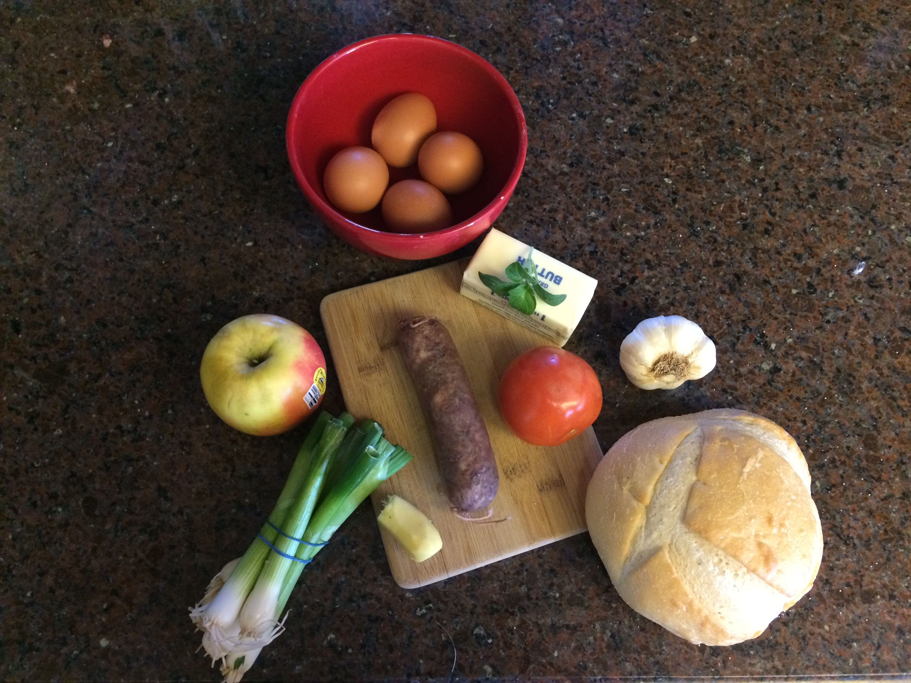

# Blood Sausage with apples, onion, and tomato over good toasted bread

##Ingredients

* 1 Blood Sausage (see recipe under charcuterie)
* 1 Apple (sweet variety)
* .5 Vidalia Onion
* 1 spoon of Minced Garlic
* 1 spoon of Grated ginger
* Olive Oil
* Fresh Oregano
* Green Onion
* Eggs
* boule of good bread (I like sourdough)

## Instructions

1) Carmelize onions (speed up mallard reaction using baking soda if needed)
2) dice apple, add to onions
3) when apples start to soften, add garlic, ginger, and tomato
4) Let the tomato cook through, add diced green onions and Oregano.
5) cook for 30 more seconds, set aside
6) Take a slice of bread from your boule and butter on both sides.  Toast in a hot pan
7) cook 2 eggs, poached or sunny side up

8) Plate with bread on bottom, hash in the middle, and topped with 2 eggs.  Garnish with more green onion
